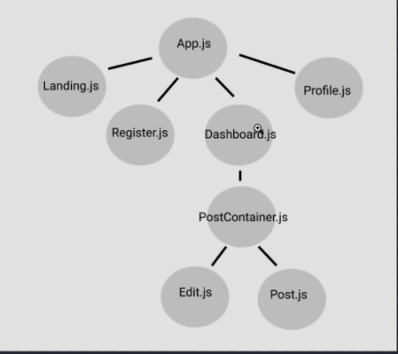

## MVP
<ul>
    <li>Login</li>
    <li>Controlled Views (After Login)</li>
    <li>Register</li>
    <li>Post Comments/Posts</li>
    <li>Edit Comments/Post</li>
    <li>Delete Comments/Posts</li>
</ul>

**Icebox**
<ul>
    <li>Delete Account</li>
    <li>Customize Background</li>
    <li>Play Music</li>
    <li>Fav Friends</li>
</ul>

## Database
### Initialize Schema
User Table
```SQL
create table users(
    user_id serial primary key,
    email varchar(100),
    password text
);
```

Post Table
```SQL
create table posts(
    post_id serial primary key,
    user_id int references users(user_id),
    content varchar(250),
    created_at date
);
```


## Server
**Dependencies**
<ul>
    <li>massive</li>
    <li>express</li>
    <li>bcrypt</li>
    <li>Express-session</li>
    <li>dotenv</li>
</ul>

**Endpoints**
auth:
 - app.post('/auth/login')
 - app.post('/auth/register')
 - app.delete('/auth/logout')
 - app.get('/auth/user')

 post:
 - app.get('/api/posts')
 - app.post('/api/post')
 - app.put('/api/posts/:post_id')
 - app.delete('/api/posts/:post_id')

## Client
**Dependencies**
<ul>
    <li>axios</li>
    <li>react-router-dom</li>
    <li>react-redux</li>
    <li>redux</li>
    <li>redux-promise-middleware</li>
</ul>

**Routes**
 - Landing Page (/)
 - Register (/register)
 - Dashboard (/dashboard)
 - Profile (/profile)

**File Structure**
- .env
- src/
    - App.js
    - App.css
    - index.js
    - reset.css
    - redux/
        - store.js
        - reducer.js
    - components/
        - Landing/ .js and .css
        - Register/ .js and .css
        - Dashboard/ .js and .css
        - Profile/ .js and .css
        - PostContainer/ .js and .css
        - Post/ .js and .css
        - Edit/ .js and .css
        - Header/ .js and .css
        - AuthHeader/ .js and .css